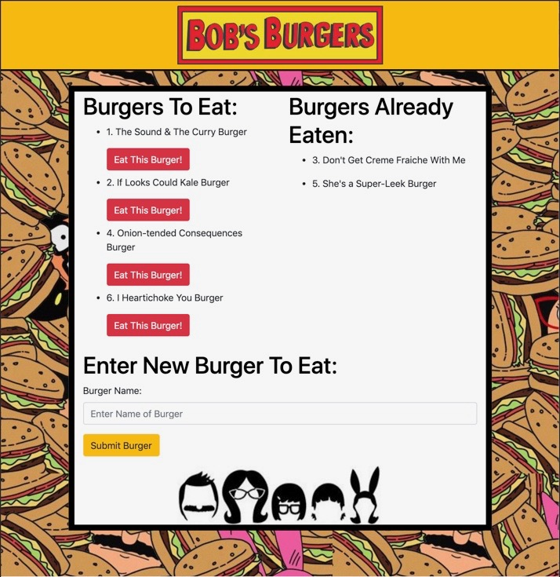

# Eat-The-Burger
This application uses Node, Express, and Handlebars to create an application for users to track burger's they would like to eat and for burgers they have devoured. User may input their own burgers and keep track of which burgers they have added and which have been devoured. 

# Technologies Used 
* JavaScript
* Node.js
* Express.js
* Handlebars 

## Code created and maintained by 
Miyoung K. Chung 
http://www.github.com/mkchung8

